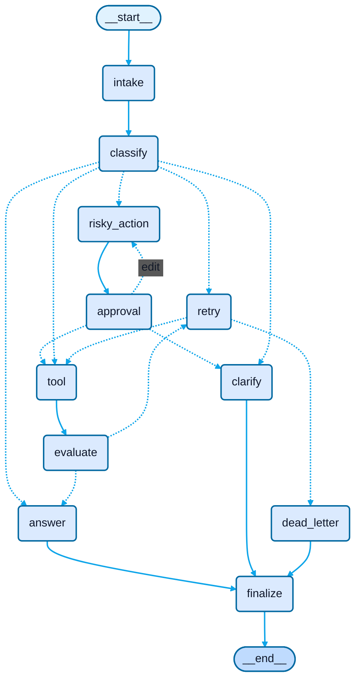

# Day 08 Lab Report

## 1. Team / student

- Name: Tiền Anh Kiệt
- Repo/commit: 6d8252d
- Date: 2026-06-29

## 2. Architecture

The graph uses a typed LangGraph state with append-only audit fields and overwrite-only decision fields. The core flow is `intake -> classify`, then conditional routing to `answer`, `tool`, `clarify`, or `risky_action -> approval`. Tool-backed flows pass through `evaluate` and, on transient typed timeout errors, enter the bounded `retry` loop before either recovering or moving to `dead_letter`. All terminal branches pass through `finalize` for audit completeness.

## 3. State schema

| Field | Reducer | Why |
|---|---|---|
| messages | append | lightweight execution breadcrumbs |
| tool_results | append | preserves tool outputs across retries |
| errors | append | keeps typed retry/dead-letter history |
| events | append | audit trail and metrics source |
| route | overwrite | latest routing decision only |
| evaluation_result | overwrite | retry gate for current tool result |
| pending_question | overwrite | active clarification request |
| proposed_action | overwrite | current risky action awaiting approval |
| approval | overwrite | latest approval decision |
| final_answer | overwrite | terminal user-facing output |

## 4. Metrics summary

| Metric | Value |
|---|---:|
| Total scenarios | 7 |
| Success rate | 100.00% |
| Avg nodes visited | 25.71 |
| Total retries | 12 |
| Total interrupts | 8 |
| Resume success | True |

## 5. Scenario results

| Scenario | Expected route | Actual route | Success | Retries | Interrupts | Approval result |
|---|---|---|---:|---:|---:|---|
| S01_simple | simple | simple | True | 0 | 0 | - |
| S02_tool | tool | tool | True | 0 | 0 | - |
| S03_missing | missing_info | missing_info | True | 0 | 0 | - |
| S04_risky | risky | risky | True | 0 | 4 | approved |
| S05_error | error | error | True | 8 | 0 | - |
| S06_delete | risky | risky | True | 0 | 4 | approved |
| S07_dead_letter | error | error | True | 4 | 0 | - |

Approval totals:
approved=2,
rejected=0,
edit=0.

## 6. Failure analysis

1. Retry or tool failure: typed timeout-style tool errors trigger `evaluate -> retry`; the loop is bounded by `attempt < max_attempts`, which prevents infinite execution and escalates to `dead_letter` when recovery fails.
2. Risky action without approval: risky requests are isolated behind `risky_action -> approval`; if approval is denied, the graph routes to `clarify` instead of executing the side effect.

## 7. Persistence / recovery evidence

The workflow compiles with a checkpointer and uses `thread_id` per scenario run. When a persistent saver is configured, state history can be inspected or replayed from the same thread, and the metrics payload records whether that persistence path was observed successfully.

## 8. Extension work

- SQLite checkpointer support via `SqliteSaver` with WAL mode.
- Optional real human-in-the-loop approval using `LANGGRAPH_INTERRUPT=true`.
- Approval interrupt request/response schema with explicit approval decisions:
  `approved`, `rejected`, and `edit`.
- Structured audit events with typed timeout metadata for retries and dead-letter handling.

## 9. Graph diagram

## 10. Improvement plan

If I had one more day, I would productionize three areas first: stronger LLM-as-judge evaluation in `evaluate_node`, richer persistence demo coverage with explicit resume/replay tests, and provider-specific prompt tuning for more robust hidden-scenario classification.
